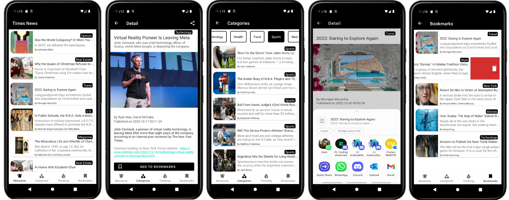
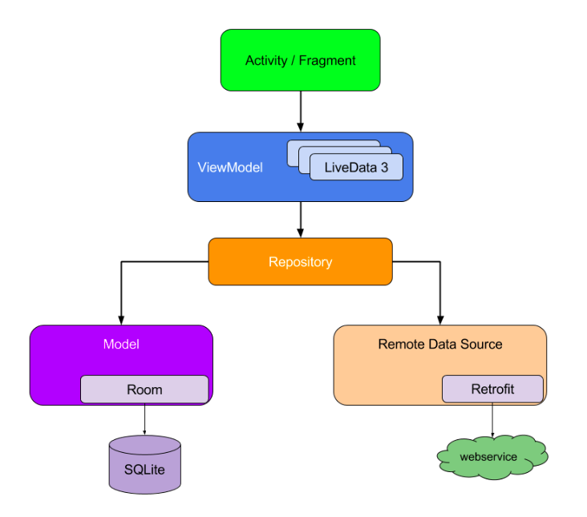

# Times News :newspaper:  
**Times News** is a sample press articles Android application built to demonstrate use of *Modern Android development* tools.



## About ⁉️
The application works with New York Times API to fetch and display different kinds of articles : Newswire, categorized articles and also trending articles.  
User can navigate through all kinds of articles via a BottomNavigationView.   
To ensure a better user experience, articles are cached in device's database after having been fetched from New York Times API. This means that user never faces a blank screen if he's experiencing network connection problems, as data is synchronized and loaded only from device's database.    

## Download ⬇️
- Download latest release [here](https://github.com/Florian-Martin/times-news/releases/tag/v1.0.0/times-news.apk)

## Built with 🛠
- [Kotlin](https://kotlinlang.org/) - First class and official programming language for Android development.
- [Coroutines](https://kotlinlang.org/docs/reference/coroutines-overview.html) - For asynchronous and more..
- [Flow](https://kotlin.github.io/kotlinx.coroutines/kotlinx-coroutines-core/kotlinx.coroutines.flow/-flow/) - A cold asynchronous data stream that sequentially emits values and completes normally or with an exception.
- [Android Architecture Components](https://developer.android.com/topic/libraries/architecture) - Collection of libraries that help you design robust, testable, and maintainable apps.
  - [LiveData](https://developer.android.com/topic/libraries/architecture/livedata) - Data objects that notify views when the underlying database changes.
  - [ViewModel](https://developer.android.com/topic/libraries/architecture/viewmodel) - Stores UI-related data that isn't destroyed on UI changes. 
  - [ViewBinding](https://developer.android.com/topic/libraries/view-binding) - Generates a binding class for each XML layout file present in that module and allows you to more easily write code that interacts with views.
  - [Room](https://developer.android.com/topic/libraries/architecture/room) - SQLite object mapping library.
  - [RecyclerView + ListAdapter](https://developer.android.com/reference/androidx/recyclerview/widget/ListAdapter) - Presenting List data in a RecyclerView, including computing diffs between Lists on a background thread 
- [Retrofit](https://square.github.io/retrofit/) - A type-safe HTTP client for Android and Java.
- [Moshi](https://github.com/square/moshi) - A modern JSON library for Kotlin and Java.
- [Moshi Converter](https://github.com/square/retrofit/tree/master/retrofit-converters/moshi) - A Converter which uses Moshi for serialization to and from JSON.
- [Coil-kt](https://coil-kt.github.io/coil/) - An image loading library for Android backed by Kotlin Coroutines.
- [Safe Args](https://developer.android.com/guide/navigation/navigation-pass-data) - To pass data through destinations
- [Unit tests](https://developer.android.com/training/testing/local-tests)
- [Instrumented tests](https://developer.android.com/training/testing/instrumented-tests)

## Architecture :construction_worker:
The application is built following MVVM pattern, additionally a repository serves as a single source of truth for the app's data, and abstracts the source of the data (network, cache, etc.) out of the view model.



## Structure 📂
```
├───data
│   │   AppDatabase.kt
│   │   Resource.kt
│   │   State.kt
│   │
│   ├───local
│   │       ArticlesDao.kt
│   │
│   ├───remote
│   │       BaseArticle.kt
│   │       CategorizedArticles.kt
│   │       NewsWireArticles.kt
│   │       Service.kt
│   │       TopStoriesArticles.kt
│   │
│   └───repository
│           ArticlesRepository.kt
│
├───model
│       Article.kt
│       ArticleCategory.kt
│
├───ui
│   │   ArticlesAdapter.kt
│   │   MainActivity.kt
│   │
│   ├───bookmarks
│   │       BookmarksFragment.kt
│   │       BookmarksViewModel.kt
│   │
│   ├───categories
│   │       CategoriesAdapter.kt
│   │       CategorizedArticlesFragment.kt
│   │       CategorizedArticlesViewModel.kt
│   │
│   ├───detail
│   │       ArticleDetailFragment.kt
│   │       ArticleDetailViewModel.kt
│   │
│   ├───newswire
│   │       NewswireFragment.kt
│   │       NewswireViewModel.kt
│   │
│   ├───splash
│   │       SplashActivity.kt
│   │       SplashViewModel.kt
│   │
│   └───trending
│           TrendingFragment.kt
│           TrendingViewModel.kt
│
└───utils
        BaseUtils.kt
        Constants.kt
        SwipeToDeleteCallback.kt
```
